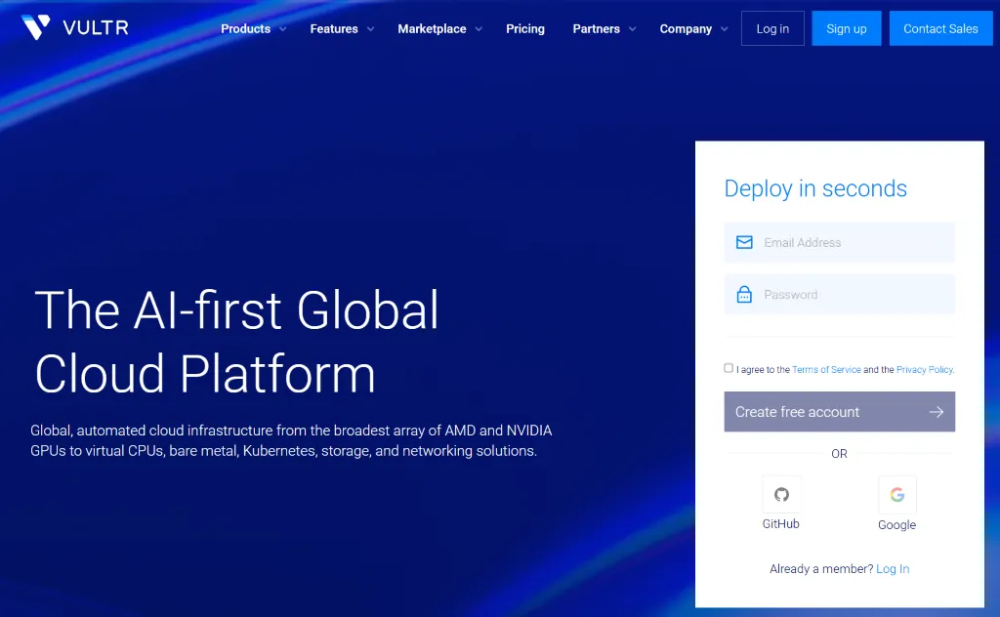

# Vultr 怎么样？按小时计费 VPS 的真实测评

Vultr 是一家成熟的老牌海外云服务提供商。其核心的产品特征在于**按小时计费**的灵活结算机制，以及**全球数十个数据中心**的广阔节点覆盖，这使得 Vultr 非常受开发者、站长及运维人员欢迎。

但在真实的业务出海、建站或测试环境中，Vultr 到底表现如何？

> **完整评测数据与教程导航**请直接访问我们的项目主站：👉 [Vultr 中文手册](https://vultrceping.github.io/)

## 认识 Vultr

Vultr 成立于 2014 年，是全球规模最大的独立云服务商之一。它与 DigitalOcean、Linode（现为 Akamai Connected Cloud）类似，为开发者提供结构清晰、即开即用的高性价比基础设施。

Vultr 官网：**[https://www.vultr.com/](https://www.vultr.com/?ref=9622724)**

对于日常建站和运维来说，了解 Vultr 需要从以下三个最核心的维度切入：

### 1. 按小时计费的底层逻辑

Vultr 采用按小时计费（Hourly Billing）机制，并设有每月封顶费用。

特别是**随用随随建，不用即删**。例如创建一台服务器，哪怕只运行了 1 小时后将其删除，也只需支付这 1 小时的费用。这使得它非常适合用于短期测试或者作为自动化 CI/CD 的临时节点。

**避坑提示（扣费误区）**

在 Vultr 的后台中，**“Stop（关机）”并不等于停止计费**。因为即使系统关闭，依然独占着母机上的 CPU 核心、内存和固态硬盘空间。**只有执行“Destroy（销毁/删除）”操作，才会停止计费。**

### 2. 多样化的产品线划分

Vultr 的实例类型较多，但普通站长和开发者最常接触的是以下三类：

**1、Cloud Compute（常规云服务器）**

最基础的 VPS 产品线。分为共享 CPU（Shared vCPU）和不同档次的硬件。

其中，新一代的 **High Performance（高性能 AMD/Intel 实例）** 采用 NVMe 固态硬盘，其单核性能和 IO 读写明显优于老旧的 Regular（常规 Intel 实例），是目前个人建站的性价比首选。

**2、Optimized Cloud Compute（优化型云服务器）**

提供**独享 CPU（Dedicated vCPU）**。适合对计算负载要求极其稳定、不接受任何 “邻居抢占资源” 影响的生产环境业务。

**3、Bare Metal（裸金属服务器）**

无虚拟化层的物理服务器，独享整台机器的硬件性能，适合超大型数据库或高负载核心业务。

### 3. 全球数十个数据中心（Data Centers）

Vultr 最强大的优势之一在于其全球节点的覆盖深度。截至目前，Vultr 在全球拥有 30 多个数据中心，遍布北美、欧洲、亚洲、澳洲及拉美地区。

对于亚太地区的中文用户而言，其部署在东京（Tokyo）、新加坡（Singapore）、首尔（Seoul）以及美西洛杉矶（Los Angeles）、硅谷（Silicon Valley）的机房是核心关注点。

## 基础套餐配置与资费参考

Vultr 的实例规格极度丰富，除上述基础款外，还提供最高支持数十个 CPU 核心的高配实例、搭载最新 AMD/Intel 架构的高性能实例（High Performance），这里不作穷举。

| 套餐 | CPU 配置 | 内存容量 | 存储空间 (NVMe) | 每月流量 (Bandwidth) | 月付估算 | 折合时付 |
| --- | --- | --- | --- | --- | --- | --- |
| vc2-1c-1gb | 1 vCPU | 1 GB | 25 GB | 1.00 TB | $5.00/mo | ~$0.007/hr |
| vc2-1c-2gb | 1 vCPU | 2 GB | 55 GB | 2.00 TB | $10.00/mo | ~$0.015/hr |
| vc2-2c-2gb | 2 vCPUs | 2 GB | 65 GB | 3.00 TB | $15.00/mo | ~$0.022/hr |
| vc2-2c-4gb | 2 vCPUs | 4 GB | 80 GB | 3.00 TB | $20.00/mo | ~$0.030/hr |

👉 **[点击这里前往 Vultr 官网注册账户](https://www.vultr.com/?ref=9622724)**

## Vultr 新用户 $300 体验金活动

如果你是首次接触 Vultr，建议充分利用官方的拉新政策。这笔体验金可以让你在前期毫无成本地进行多机房网络测速、高配实例性能压测或是各类环境的搭建试错。

目前 Vultr 针对新注册用户开放了赠送 $300 测试额度的活动。注意：**领取该额度必须是全新注册的账户，并且需要绑定真实的信用卡（或 PayPal）进行基础验证**。

👉 **[点击这里注册账户，验证信用卡并领取 $300 体验金](https://www.vultr.com/?ref=9634222-9J)**

## 硬件基准测试：入门级实例的真实表现

为了探究 Vultr 基础产品的实际承载力，我们直接选取了其价格最低的入门级实例（常规 Cloud Compute 共享 CPU 方案）进行了核心硬件的压测。

我们过滤了冗长的终端日志，直接提取最核心的性能指标：

### 1. 测试数据汇总

| 硬件维度 | 测试工具与核心参数 | 测试结果 | 表现评级 |
| --- | --- | --- | --- |
| **CPU 计算性能** | `sysbench cpu` *(单线程, 持续 60s)* | **914.78** events/sec | 基础共享型 |
| **内存读写性能** | `sysbench memory` *(1KiB 块大小, 写入)* | **4343.91** MiB/sec | 正常水准 |
| **磁盘 4K 随机读写** | `fio randrw` *(4k, ioengine=psync)* | **Read**: 5409 IOPS (21.1MiB/s) **Write**: 5402 IOPS (21.1MiB/s) | 常规 SSD |
| **磁盘 1M 顺序读写** | `fio seqrw` *(1M, ioengine=psync)* | **Read**: 156MiB/s **Write**: 174MiB/s | 中规中矩 |

### 2. 性能表现评估

面对这份压测数据，给出一个客观的评价：**这套硬件的性能表现不算特别亮眼，但是并不差。**

它完全符合该价位段云服务器的应有水准，没有明显的缩水或严重的 I/O 瓶颈：

* **计算能力务实**：单核 900+ 的 `sysbench` 跑分，意味着它无法胜任高密度的运算任务（如视频转码或大型数据抓取）。但对于运行小型站点来说，性能绰绰有余。
* **磁盘 I/O 稳定**：对于数据库应用（如 MySQL 或 PostgreSQL），最看重的是 4K 随机读写能力。双向 5400 左右的 IOPS 足以支撑中小型站点的日常数据库并发请求。

### 性能测试总结

如果你需要搭建的是一个重度负载的商业级应用，建议升级至 Vultr 的 High Performance（NVMe 固态）或独享 CPU 实例。但如果你的需求是搭建个人博客或测试环境，选择“最便宜”的就行。

## 选机与避坑建议（个人经验总结）

作为长期接触各类 VPS 及服务器架构的站长，我在这部分脱离官方文档，从实际的运维和建站角度，给出几点非常主观但务实的购买与使用建议。

### 1. 认清网络路由的现实（非 CN2 GIA/CMIN2）

很多新手在购买海外 VPS 时，对“直连国内延迟低”抱有不切实际的幻想。必须明确指出：**Vultr 的强项在于国际互联带宽大，而非国内直连的链路优化。**

它走的是常规的国际 BGP 线路，**并没有接入电信 CN2 GIA、移动 CMIN2 等优化专线**。这意味着在晚高峰时段，面向中国大陆的去程和回程路由可能会出现一定程度的拥堵、延迟升高或丢包。

所以如果你的项目是面向海外用户的外贸站，Vultr 的网络无可挑剔。如果是面向国内访问的站点，强烈建议前端套一层 Cloudflare CDN，以弥补直连路由的短板。

### 2. 充分利用计费机制进行 “IP 开盲盒”

由于部分海外云服务商的 IP 段常年被扫描和封锁，可能开出 “被墙 IP”（即国内无法 PING 通）。

面对这种情况，不要去寻找所谓的 “解封教程”，也不要花时间去提工单要求客服更换 IP。**直接利用 Vultr 按小时计费的特性：**

* 开通一台实例后，立刻在本地终端或使用第三方工具测试 IP 连通性。
* 如果 IP 不通，**直接点击 Destroy（销毁实例）**，然后重新开一台新的，直到开出可用 IP。
* 这个试错过程通常只需消耗几美分，这是按小时计费模式最大的隐藏福利。

### 3. 实例配置的务实选择（拒绝性能焦虑）

对于个人开发者而言，最容易犯的错误是过度配置（Over-provisioning）。

* **轻量化部署**：如果你只是准备安装纯净版 Linux，跑几个轻量的 Docker 容器，或者部署 1Panel 这样的轻量化运维面板来托管几个静态页面。
* **数据库需求**：如果你的技术栈涉及到高频查询的 PostgreSQL 或 MySQL，或者是动态化较重的 WordPress 站点，建议起步选择 **2GB 内存**，并且优先选择 **NVMe**。

### 4. 账号风控与支付常识

Vultr 拥有非常严格的自动化风控系统（Fraud Prevention），一旦触发，账号会被秒封或限制购买。

* **注册环境**：**不要**挂着任何代理去注册 Vultr 账号，会有概率触发风控。
* **信息真实**：个人资料尽量填写真实信息（至少国家和地区必须匹配你的网络和支付方式）。
* **支付方式**：Vultr 官方原生支持支付宝（Alipay）、双币信用卡和 PayPal。

## 理性上云，按需选择

Vultr 的核心价值非常明确：**它提供了一个试错成本极低、节点覆盖极广的基础计算平台。**

它或许不具备顶级的国内直连网络优化，但凭借按小时计费的机制和稳定达标的硬件基准，Vultr 依然是开发者测试项目、搭建出海业务以及部署轻量化应用的优质工具。

对于云主机，没有绝对的 “最好”，只有在特定业务场景和预算下的 “最合适”。为了方便你进一步了解和使用，以下是核心的资源直达链接：

### 🔗 前往 Vultr 官网

如果你准备亲自测试机房网络或开始部署项目，建议充分利用官方的拉新额度进行零成本试错。你可以 **[点击这里直接前往 Vultr 官网](https://www.vultr.com/?ref=9622724)** ，或者 **[点击这里注册并领取 $300 新用户体验金](https://www.vultr.com/?ref=9634222-9J)**

### 📚 访问 Vultr 中文手册

本仓库仅为核心逻辑的导读。关于各机房的详细测速 IP、性能压测对比图表、以及从环境配置（Docker/面板）到建站（WordPress/静态框架）的完整指南，请前往 **[Vultr 中文手册南](https://vultrceping.github.io/)**。

---

*文档维护声明：本手册秉持客观、理性的原则，测试数据均来源于真实环境下的脚本跑分。*